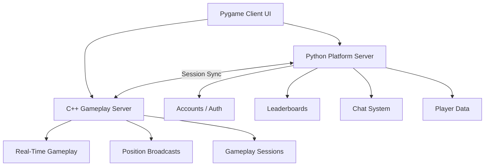

# Scorpions Arcade

### How to Start & Project Overview

---

## What is This?

Scorpions Arcade is a multi-game arcade platform built with a **Pygame client**, a **Python platform server**, and a **C++ gameplay server**.

Players can log in, browse games, launch team games, use in-game chat, record scores, view leaderboards, and track profile/history data.

---

## Architecture Overview

### High-Level Flow

```text
           +----------------------+
           |   Pygame Client UI   |
           | (Arcade Frontend)    |
           +----------+-----------+
                      |
        ---------------------------------
        |                               |
+-------v--------+              +--------v--------+
| Python Server  |              | C++ Game Server |
| Accounts/Auth  |              | Real-Time Game  |
| Leaderboards   |              | Position Sync   |
| Chat + Data    |              | Gameplay Relay  |
+-------+--------+              +--------+--------+
        |                                |
        +--------------------------------+
              Sessions / Scores / Chat
```

### Mermaid Diagram



---

## 1. Clone the Repository

```bash
git clone https://github.com/Shahreare-Joy/ece-3822-final-project-scorpions.git
cd ece-3822-final-project-scorpions
```

---

## 2. Start the Servers

### Python Platform Server

Run from the project root:

```bash
python -m platform_server.server --host 0.0.0.0 --port 50068 --serializer json
```

This server handles login, accounts, leaderboards, chat, profile data, history, and saved results.

### C++ Gameplay Server

Run from the project root:

```bash
cd server
./server_json_jitter --port 50069
```

On Windows PowerShell, use:

```powershell
cd server
.\server_json_jitter.exe --port 50069
```

If Linux/ECE says `Permission denied`, run:

```bash
cd server
chmod +x server_json_jitter
./server_json_jitter --port 50069
```

---

## 3. Run the Arcade Client

Run from the project root:

```bash
python main.py --server 127.0.0.1 --port 50068 --game-port 50069 --serializer json
```

For local-only mode, you can also run:

```bash
python main.py
```

Server mode is recommended for the final demo because it connects the arcade client to the Python platform server and passes the gameplay server port into games.

---

## 4. Logging In

1. Open the arcade client.
2. Click **Log In**.
3. Use any demo account below.

### Demo Accounts

| Username | Password |
| -------- | -------- |
| evan     | ave428   |
| emmanuel | mem913   |
| ibrahim  | bri517   |
| hamza    | amh075   |
| mennah   | enm246   |
| damien   | mad632   |
| deven    | ved391   |
| vraj     | arv447   |
| paul     | uap604   |
| owen     | ewo524   |
| jude     | udj738   |
| minju    | imn881   |
| michael  | cim829   |
| santiago | nas302   |
| kevin    | vek069   |
| kimberly | mik990   |
| richard  | cir412   |
| mykai    | ykm082   |
| thomas   | hot585   |
| nicholas | cin672   |
| ellie    | lle734   |
| chuqi    | huc231   |
| ryan     | ayr260   |
| sal      | als911   |

---

## 5. Controls & Tips

- `ESC` - Exit current game or return to arcade.
- `T` or `C` - Open / close in-game chat where supported.
- `Enter` - Send chat message while typing.
- `R` - Restart on supported game-over screens.
- `L` - Level menu in Fruit Drop Rush.

---

## Features

- Multiple playable team arcade games.
- Pygame arcade UI with browse, profile, history, leaderboard, and game details screens.
- Python platform server for accounts, data loading, chat, score recording, and leaderboard/history sync.
- C++ gameplay server for real-time gameplay connection and basic multiplayer sync.
- Session-based chat with bad-word filtering.
- Custom data structures including hash tables, BSTs, heaps, bloom filter, graph, sparse matrix, stack, and circular-buffer style chat history.
- Score submission, profile updates, recent sessions, and match history.

---

## Team Games

All team games launch through:

```text
games/game_N/code/game/main.py
```

Current team game status:

- `games/game_1` - **Fruit Drop Rush**: playable, score-based fruit/hazard game.
- `games/game_2` - **Escape the City**: playable, kill count is submitted as score.
- `games/game_3` - **Forgotten**: playable, town-map adventure with enemies, timer, and score.
- `games/game_4` - **Mystical Bamboo**: playable, score/result support included.

Team game leaderboards start empty and populate only from real submitted sessions.

---

## Project Structure

```text
ece-3822-final-project-scorpions/
├── main.py                         # Arcade client entry point
├── README.md                       # Start guide and project overview
├── client/                         # Pygame arcade frontend
│   ├── assets/                     # Login art, thumbnails, screenshots
│   ├── components/                 # UI components and chat overlay
│   ├── core/                       # App shell and shared client helpers
│   ├── data/                       # Mock/catalog data helpers
│   ├── integrations/               # C++ gameplay server connection helpers
│   ├── models/                     # Client-side data models
│   ├── placeholders/               # Placeholder UI/assets
│   ├── screens/                    # Login, home, browse, profile, history, details
│   └── services/                   # Chat, launch, backend, leaderboard services
├── platform_server/                # Python platform server
│   ├── server.py                   # Platform server entry point
│   ├── accounts.py                 # Account/auth helpers
│   ├── chat.py                     # Session chat handling
│   ├── leaderboard.py              # Score ranking and leaderboard data
│   ├── history.py                  # Player session history
│   ├── session_results.py          # Game result submission
│   └── data_ingest.py              # Dataset/data loading support
├── datastructures/                 # Shared custom data structures
│   ├── array.py                    # Custom array/list storage
│   ├── hash_table.py               # Account/profile lookup support
│   ├── bst.py                      # Search/ranking support
│   ├── heap.py                     # Ranking/matchmaking support
│   ├── circular_buffer.py          # Chat/message rolling history
│   ├── graph.py                    # Relationship/path-style structures
│   ├── linked_list.py              # Linked node storage
│   ├── linked_queue.py             # Queue for traversal/workflow logic
│   ├── linked_stack.py             # Stack for traversal/history logic
│   └── session_history.py          # Session history structure helpers
├── games/                          # Team games
│   ├── game_1/code/game/main.py    # Fruit Drop Rush launch path
│   ├── game_2/code/game/main.py    # Escape the City launch path
│   ├── game_3/code/game/main.py    # Forgotten launch path
│   └── game_4/code/game/main.py    # Mystical Bamboo launch path
├── server/                         # C++ gameplay server
│   ├── server_json_jitter          # Linux/ECE executable
│   ├── server_json_jitter.exe      # Windows executable if built locally
│   ├── src/                        # C++ server source
│   └── include/                    # C++ server headers
├── data/                           # Runtime data and generated datasets
├── docs/                           # Project documentation and presentation notes
├── tests/                          # Automated/manual test support
└── tools/                          # Utility scripts
```

---

## Notes

- If the client cannot connect, make sure both servers are running.
- If the C++ server will not start on Linux/ECE, run `chmod +x server_json_jitter`.
- If a port is already in use, stop the old server process or choose another port.
- Chat should keep working in local fallback mode if the platform server is unavailable.
- Scores and history sync after supported games submit results back to the arcade.

---

## Quick Summary

1. Start the Python platform server.
2. Start the C++ gameplay server.
3. Run the arcade client.
4. Log in with a demo account.
5. Play a team game.
6. Check leaderboard, profile, history, and chat.
